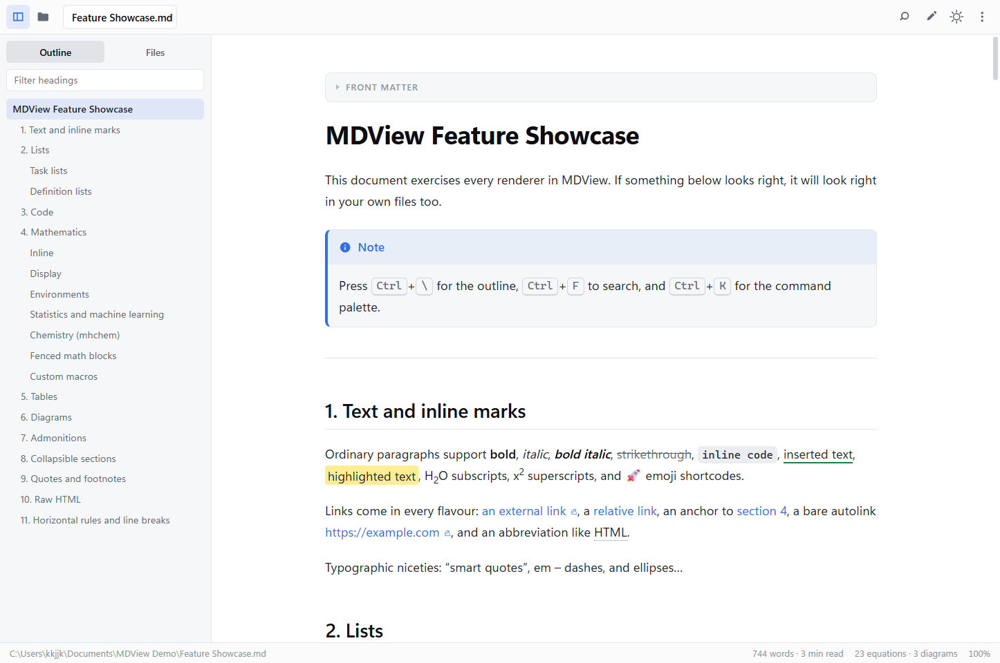
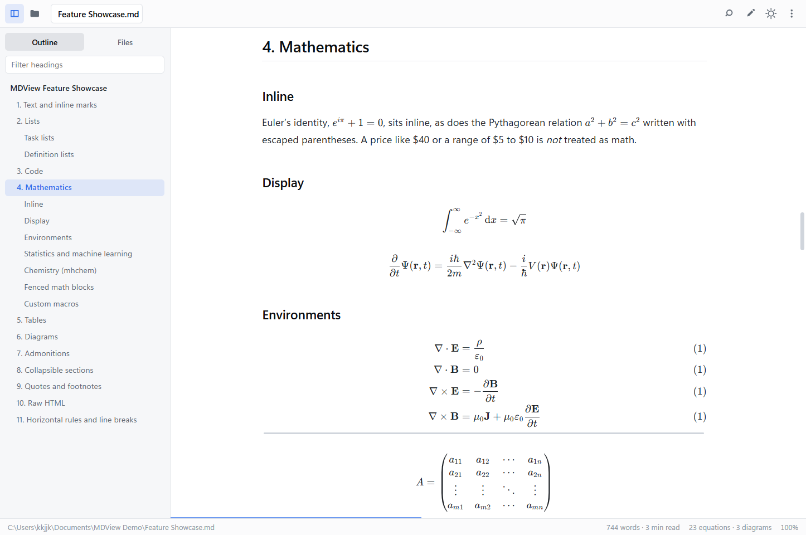
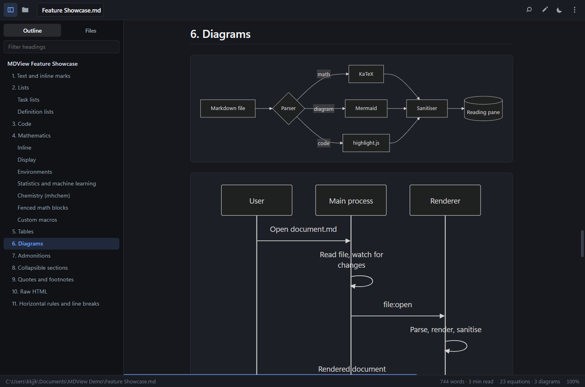
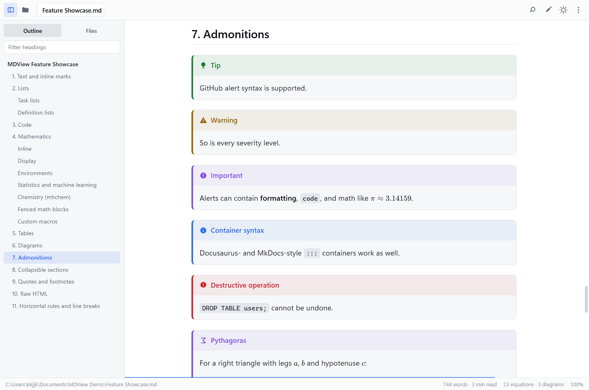
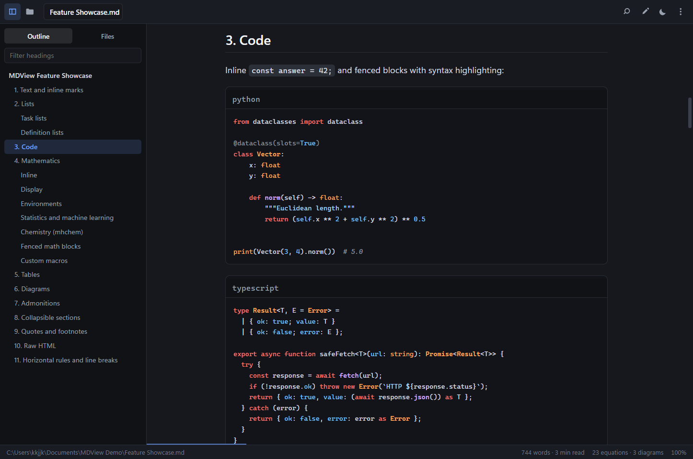
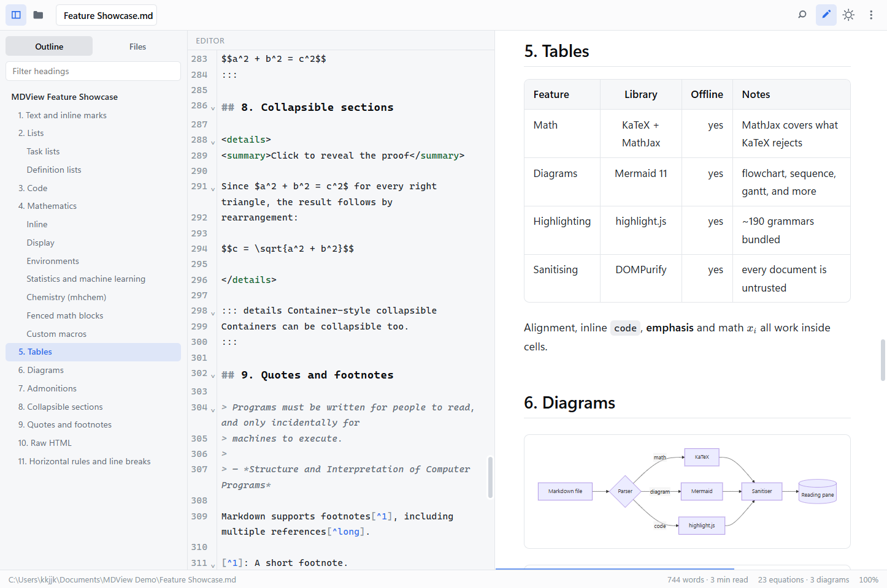
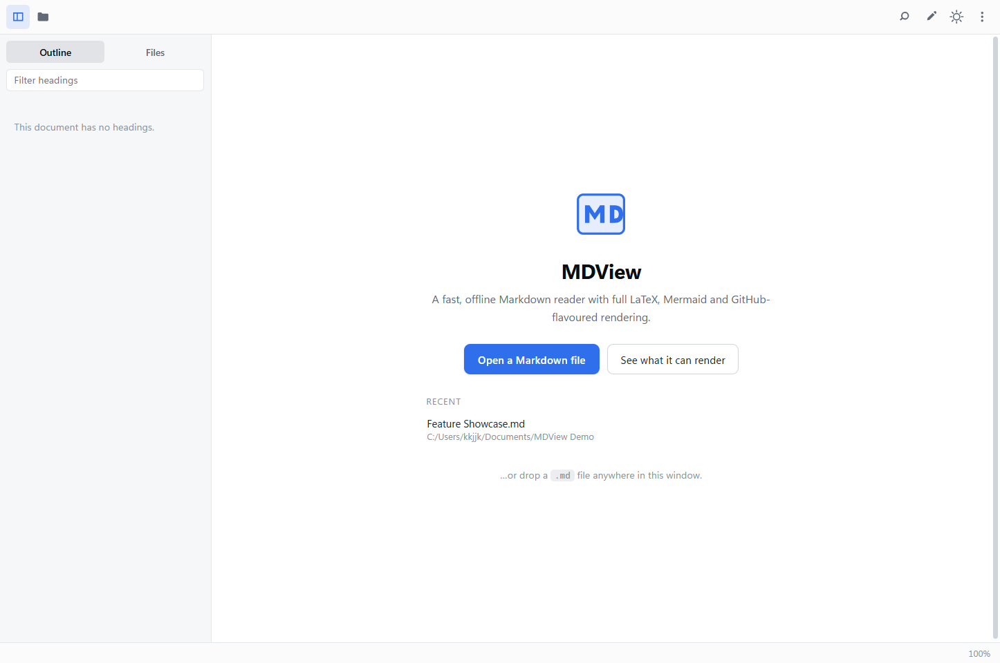

<div align="center">


# MDView

**A fast, offline desktop reader for Markdown — built for documents full of mathematics.**

Like Acrobat Reader, but for `.md`. Open a file, read it, close it.
No account, no cloud, no telemetry, no editor you didn't ask for.

[](../../releases/latest)
[](LICENSE)
[](../../releases/latest)



</div>

---

## Why

Most Markdown viewers treat mathematics as an afterthought. They handle `$x^2$`
and give up on `\begin{align}`, or they render equations but choke on a
thousand of them. MDView is built the other way round: **the maths comes
first**, and everything else is expected to keep up with it.

- Every LaTeX delimiter style, including bare AMS environments
- KaTeX for speed, with a full MathJax fallback so nothing is ever lost
- A 1000-equation document opens in **114 ms** and scrolls at **144 fps**
- Works completely offline — no network access at any point

---

## Download

Grab the installer for your platform from the
**[latest release](../../releases/latest)**.

| Platform | File | Notes |
|---|---|---|
| Windows 10/11 (64-bit) | `MDView-Setup-1.0.0-x64.exe` | Recommended for most PCs |
| Windows on ARM | `MDView-Setup-1.0.0-arm64.exe` | Surface Pro X, Snapdragon laptops |
| Windows (either) | `MDView-Setup-1.0.0.exe` | Universal installer, both architectures |
| Windows, no install | `MDView-Portable-1.0.0.exe` | Runs from a USB stick, writes no registry keys |
| Linux (64-bit) | `mdview-1.0.0.tar.gz` | Extract and run `./mdview` |

> **Windows SmartScreen** may warn on first run because the installer is not
> code-signed with a paid certificate. Choose *More info → Run anyway*.

After installing, `.md`, `.markdown`, `.mdx`, `.qmd` and `.rmd` files can be
opened by double-clicking them.

---

## Mathematics

Every form an editor, a paper, or a chat assistant is likely to produce:

| Syntax | Example |
|---|---|
| Inline, dollars | `$e^{i\pi} + 1 = 0$` |
| Inline, parentheses | `\(a^2 + b^2 = c^2\)` |
| Display, dollars | `$$ \int_0^1 x^2\,dx $$` |
| Display, brackets | `\[ \sum_{k=1}^{n} k \]` |
| Bare environments | `\begin{align} … \end{align}` |
| Fenced blocks | ` ```math `, ` ```latex `, ` ```katex ` |
| Chemistry | `\ce{CO2 + C -> 2 CO}` |
| Your own macros | `\newcommand{\R}{\mathbb{R}}`, declared anywhere |

All the AMS environments work at the top level with no delimiters at all:
`equation`, `align`, `gather`, `multline`, `flalign`, `alignat`, `split`,
`cases`, `array`, `matrix`, `pmatrix`, `bmatrix`, `vmatrix`, `CD`, and every
starred variant.

Prose is left alone. `$5 and $10`, `` `$HOME` ``, and `$PATH` inside a code
fence are never mistaken for equations.

<div align="center">

</div>

---

## Everything else it renders

<table>
<tr><td width="50%" valign="top">

**Markdown**
- Tables — multi-line, rowspan, headerless
- Task lists, footnotes, definition lists
- `==highlight==`, `++insert++`, `~sub~`, `^sup^`
- Abbreviations, emoji shortcodes, attributes
- YAML front matter as a metadata card
- Collapsible `<details>` sections
- Raw HTML, always sanitised first

</td><td width="50%" valign="top">

**Beyond Markdown**
- Mermaid diagrams — 13 types
- ~190 languages of syntax highlighting
- Line-coloured `diff` blocks
- Admonitions in both `> [!NOTE]` and `:::note` styles
- Copy button and soft-wrap on every code block
- Relative images, video and audio
- Export to PDF, HTML, PNG and plain text

</td></tr>
</table>

<div align="center">

<br><br>


</div>

---

## The reading experience

- **Outline sidebar** that follows you as you scroll, with a filter box
- **Find in document** with regex and case options
- **Command palette** on <kbd>Ctrl</kbd>+<kbd>K</kbd> for everything else
- **Tabs**, drag-and-drop, recent files, and a folder browser
- **Live reload** when a file changes on disk — unsaved edits are never lost
- **Optional editor pane** with synchronised scrolling, when you do want to edit
- Light, dark and system themes; four reading widths; three type families
- Focus mode, full screen, zoom — all remembered between sessions

<div align="center">

</div>

---

## Keyboard shortcuts

| Action | Shortcut |
|---|---|
| Open file / folder | <kbd>Ctrl</kbd>+<kbd>O</kbd> / <kbd>Ctrl</kbd>+<kbd>Shift</kbd>+<kbd>O</kbd> |
| Open recent file | <kbd>Ctrl</kbd>+<kbd>1</kbd>…<kbd>9</kbd> |
| New / close tab | <kbd>Ctrl</kbd>+<kbd>T</kbd> / <kbd>Ctrl</kbd>+<kbd>W</kbd> |
| Next tab | <kbd>Ctrl</kbd>+<kbd>Tab</kbd> |
| Find in document | <kbd>Ctrl</kbd>+<kbd>F</kbd> |
| Command palette | <kbd>Ctrl</kbd>+<kbd>K</kbd> |
| Go to heading | <kbd>Ctrl</kbd>+<kbd>Shift</kbd>+<kbd>P</kbd> |
| Previous / next heading | <kbd>Ctrl</kbd>+<kbd>↑</kbd> / <kbd>Ctrl</kbd>+<kbd>↓</kbd> |
| Toggle outline | <kbd>Ctrl</kbd>+<kbd>\\</kbd> |
| Toggle editor | <kbd>Ctrl</kbd>+<kbd>E</kbd> |
| Toggle theme | <kbd>Ctrl</kbd>+<kbd>Shift</kbd>+<kbd>L</kbd> |
| Focus mode | <kbd>Ctrl</kbd>+<kbd>Shift</kbd>+<kbd>F</kbd> |
| Text size | <kbd>Ctrl</kbd>+<kbd>+</kbd> / <kbd>Ctrl</kbd>+<kbd>−</kbd> / <kbd>Ctrl</kbd>+<kbd>0</kbd> |
| Print / export PDF | <kbd>Ctrl</kbd>+<kbd>P</kbd> / <kbd>Ctrl</kbd>+<kbd>Shift</kbd>+<kbd>E</kbd> |
| Full screen | <kbd>F11</kbd> |
| Scroll, top, bottom, find | <kbd>j</kbd> <kbd>k</kbd> <kbd>g</kbd> <kbd>G</kbd> <kbd>/</kbd> |

---

## Performance

Measured on a 144 Hz display, where a frame has to be finished in 6.94 ms.

| | Result |
|---|---|
| Launch to visible window | ~310 ms |
| Open a typical document | 60–170 ms |
| Open a 1116-equation, 61 000 px document | 114 ms, maths fills in behind you |
| Scrolling, normal maths density | 6.9 ms/frame — a solid **144 fps** |
| Scrolling, extreme maths density | 14 ms/frame — 72 fps |

Large documents stay responsive because off-screen content is skipped
entirely, equations are typeset after first paint nearest the viewport first,
and nothing measures the document during a scroll.

---

## Privacy

MDView never opens a network connection. It has no analytics, no update
checks, no crash reporting and no account system. Files you open stay on your
machine, and every document is rendered inside a sandboxed, script-free page.

---

## License

[Apache License 2.0](LICENSE) — free to use, including commercially.

<div align="center">
<br>

</div>
